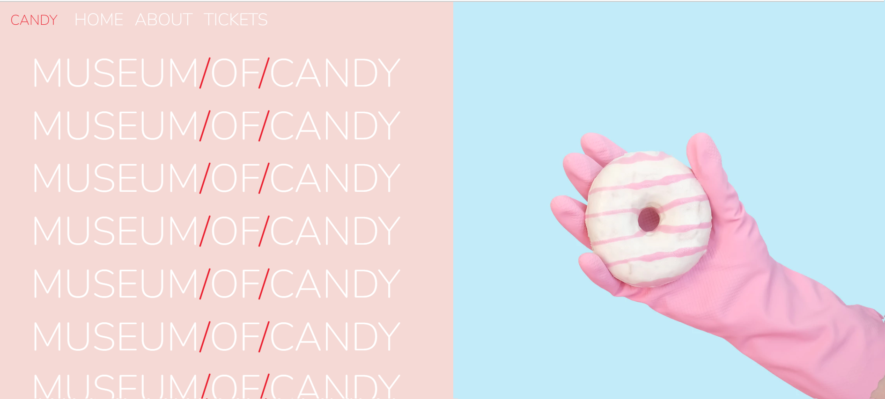

# Museum of Candy

## Project Overview

The **Museum of Candy** is a visually appealing, responsive, and interactive landing page for a fictitious museum that specializes in candy exhibits. The page is designed using Bootstrap 4, custom CSS, and jQuery for dynamic interactions. The project demonstrates a clean, modern design, smooth scrolling effects, and attention to visual aesthetics.

## Features

- **Responsive Design**: Built with Bootstrap 4 to ensure the website looks great on all devices.
- **Smooth Scroll Effects**: Navbar transitions smoothly as the user scrolls.
- **Interactive Sections**: Engaging content sections showcasing the museum's features.
- **Custom Styles**: The project uses custom CSS to add personalized design elements like colors, fonts, and layout enhancements.

## Technologies Used

- **HTML5**: The foundation of the website.
- **CSS3**: Custom styles for layout, fonts, and visual effects.
- **Bootstrap 4**: Responsive grid system and components.
- **jQuery**: Adds scroll-triggered effects to the navigation bar.
- **Google Fonts**: Nunito font is used for a sleek, modern typography style.

## File Structure

```bash
museum-of-candy/
│
├── index.html       # Main HTML page with structure and content
├── app.css          # Custom styles for the project
├── imgs/            # Folder for images used in the project (e.g., hand2.png, milk.png)
└── README.md        # Documentation of the project
```

## Setup Instructions
1. Clone the Repository
To get a local copy of the repository, clone it using Git:

```bash
git clone https://github.com/EmokeVagyas/museum-of-candy.
```

2. Navigate to the Project Directory
```bash
cd museum-of-candy
```
3. Open the Project
Simply open index.html in a browser to view the website:

```bash
open index.html
```

Alternatively, you can use a local development server, such as Live Server in VSCode.

## Custom CSS Explanation

### `app.css` Highlights:

- Blurb Styles: Sets the design for the "Museum of Candy" sections, with large red headings and white text.

```css
.blurb h2 {
    color: #EA1C2C;
    font-weight: 100;
    font-size: 2.5rem;
}

.blurb p {
    color: white;
    font-weight: 500;
    font-size: 1.125rem;
    line-height: 2;
}
```

- Navbar Scroll Effect: Changes the background color of the navbar when the user scrolls down.

```css
.navbar.scrolled {
    background-color: rgb(222, 192, 222);
    transition: background 500ms;
}
```

## jQuery Scroll Effect

The script below adds the scroll-triggered effect to the navigation bar:

```javascript
$(function () {
  $(document).scroll(function () {
    var $nav = $("#mainNavbar");
    $nav.toggleClass("scrolled", $(this).scrollTop() > $nav.height());
  });
});
```

This ensures that the navbar background color changes once the user scrolls past the height of the navbar.

## Screenshots



## License
This project is licensed under the MIT License - see the LICENSE file for details.

## Contact
Created by Emoke Vagyas - GitHub - feel free to reach out for any queries!